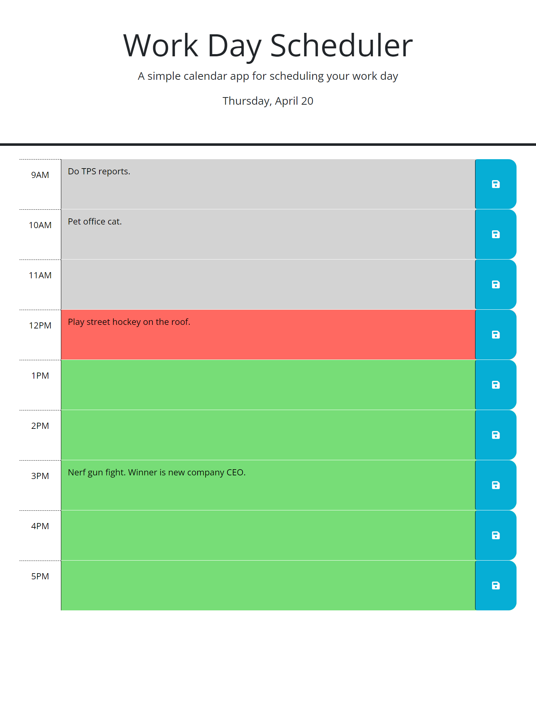

# work-day-scheduler

## Description

A simple work day planner limited to regular 9-5 bussiness hours.

https://prettiestrobot.github.io/work-day-scheduler/

## Instructions

- Click on a row and input a note or task in the input field. 
- Click the save icon to the right of the row to save the task to local storage.
- Tasks will remain until overwritten or cache is cleared.
- Rows are color coded base on past, present or future tasks. (Grey: Past, Red: Present, Green: Future)
- If the current time is outside of regular office hours all tasks will appear as past tasks.
- To test css feature outside of office hours open script.js. Comment out line 28 and uncomment line 30. This will set the current time to 12pm. 

